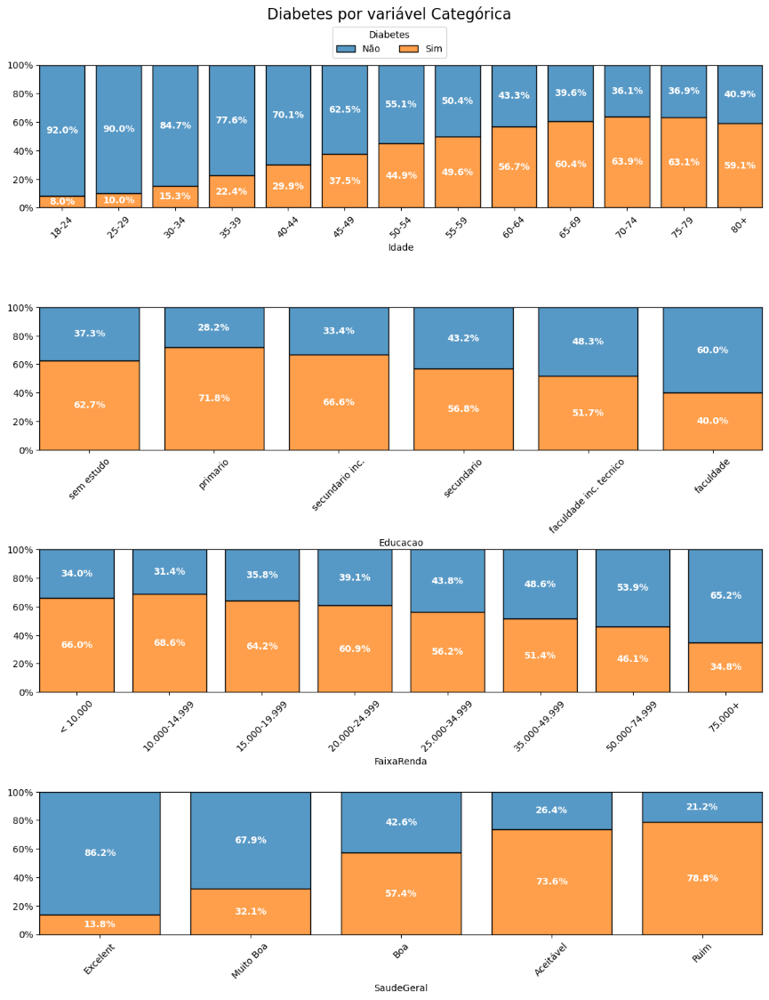

# Análise Estatística - Base de Dados Diabetes EUA 2015

O diabetes é uma doença crônica grave na qual os indivíduos perdem a capacidade de regular efetivamente os níveis de glicose no sangue e pode levar a uma redução na qualidade de vida e na expectativa de vida.

O Sistema de Vigilância de Fatores de Risco Comportamentais (BRFSS) é uma pesquisa telefônica relacionada à saúde que é coletada anualmente pelo CDC (Centro de Controle e Prevenção de Doenças dos Estados Unidos). A cada ano, a pesquisa coleta respostas de milhares de americanos sobre comportamentos de risco relacionados à saúde, condições crônicas de saúde e o uso de serviços preventivos. Para este projeto, foi utilizado conjunto de dados disponível no Kaggle para o ano de 2015. 


https://www.kaggle.com/datasets/alexteboul/diabetes-health-indicators-dataset

## Organização do projeto

```
├── .gitignore         <- Arquivos e diretórios a serem ignorados pelo Git
├── ambiente.yml       <- O arquivo de requisitos para reproduzir o ambiente de análise
├── LICENSE            <- Licença de código aberto - MIT
├── README.md          <- README principal para desenvolvedores que usam este projeto.
|
├── dados              <- Arquivos de dados para o projeto.
|
├── notebooks          <- Cadernos Jupyter.
│
|   └──src             <- Código-fonte para uso neste projeto.
|      │
|      ├── __init__.py  <- Torna um módulo Python
|      ├── auxiliares.py  <- Funções e Scripts para Análise de dados, visualização exploratória da base de dados. 
|      ├── config.py    <- Configurações básicas do projeto
|      └── graficos.py  <- Scripts para criar visualizações exploratórias e orientadas a resultados
|
├── referencias        <- Dicionários de dados.
|
└── imagens        <- Gráficos e figuras gerados para serem usados em relatórios
```

## Configuração do ambiente

1. Faça o clone do repositório que será criado a partir deste modelo.

    ```bash
    git clone git@github.com:loykeevan/estatistica_diabetes.git
    ```

2. Crie um ambiente virtual para o seu projeto utilizando o `conda`:

      ```bash
      conda env create -f ambiente.yml --name diabetes
      ```

    b. Caso esteja utilizando outro gerenciador de ambientes, exporte as dependências
    para o arquivo `requirements.txt` ou outro formato de sua preferência. Adicione o
    arquivo ao controle de versão, removendo o arquivo `ambiente.yml`.

### Conhecendo mais sobre a Base de Dados:

[Clique aqui](referencias/01_dicionario_de_dados.md) para ver o dicionário das variáveis da base de dados ultilizada.

### Alguns Resultados Obtidos:


